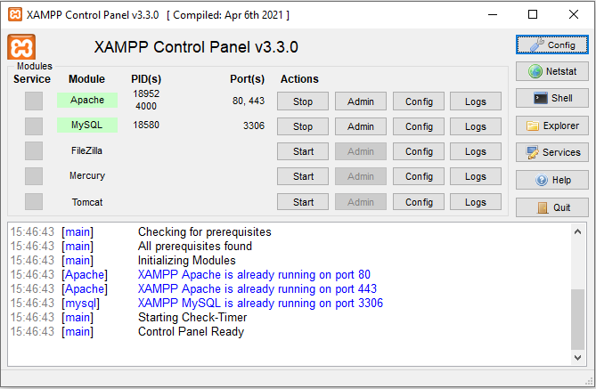
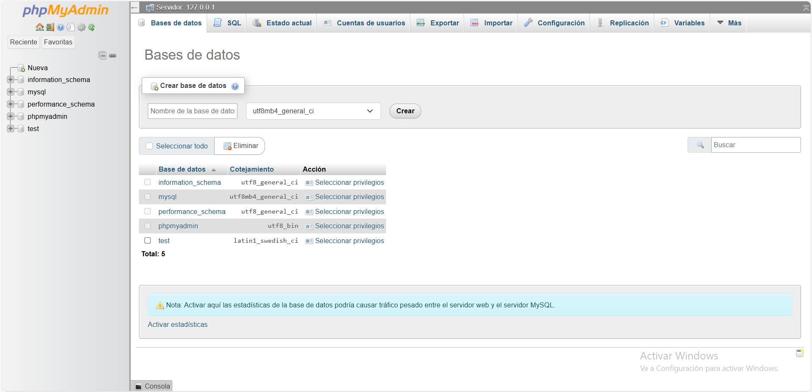
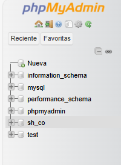
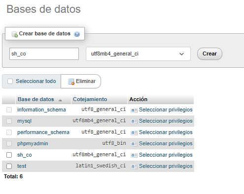
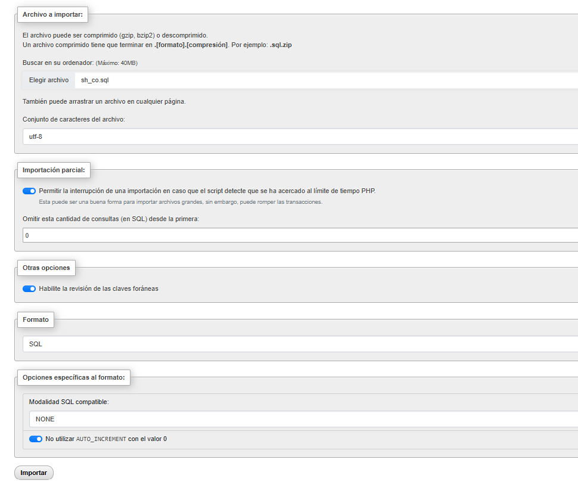
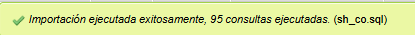
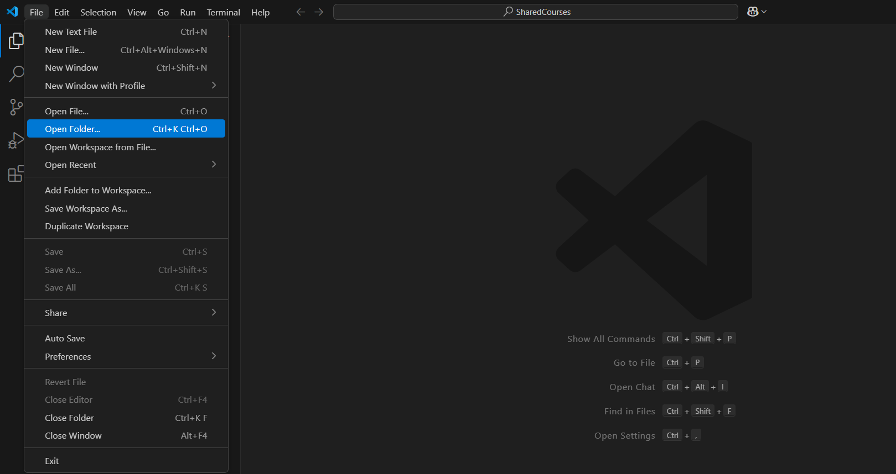
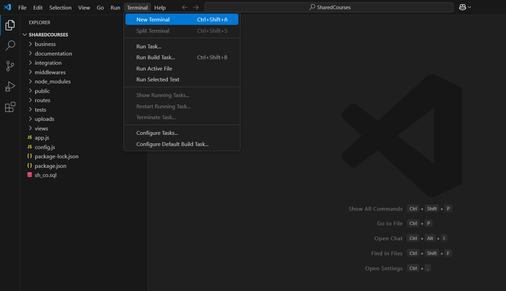
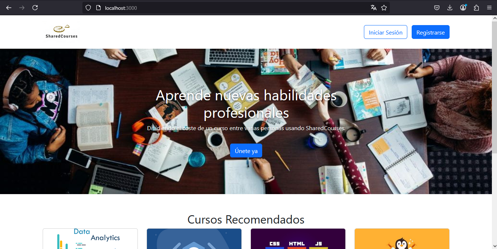

# Guía de instalación del TFG Shared Courses en WINDOWS
## Herramientas necesarias
- [XAMPP](https://www.apachefriends.org/es/index.html)
- [Node.js](https://nodejs.org/es)
- [Visual Studio Code](https://code.visualstudio.com/)
- Cualquier navegador web

## Inicializar servidor usando XAMPP
Una vez XAMPP este instalado, se mostrará un panel como se muestra en la siguiente figura:

Hay que inicializar los modulos de Apache y MySQL haciendo click en Start en la columna de Actions.

Luego hay que hacer click en admin a la derecha del boton Start de la fila del modulo de MySQL para inicializar phpMyAdmin.

## Crear base de datos con phpMyAdmin
Una vez abierto se muestra una interfaz como en la figura:

Antes de todo, hay que hacer unos preparativos para subir el archivo de la base de datos:

Primero hay que cambiar el valor de max_allowed_packet ya que el archivo de la base de datos es más grande de lo que permite la configuración del servidor predeterminada, para ello hay que dirigirse a la pestaña SQL y ejecutar el siguiente comando (usando el boton de Continuar):

`SET GLOBAL max_allowed_packet = 67108864;`

Nota: este comando requiere privilegios de SUPER o SESSION_ADMIN en el caso que no se dispongan ejecutar el siguiente comando

`SET SESSION max_allowed_packet = 67108864;`

Hay que crear la base de datos vacía antes de ejecutar el script .sql en ella, por tanto hacemos click en Nueva en el panel de la izquierda:

Luego nos muestra otra imagen donde podemos elegir la compatibilidad de carácteres de la base de datos y el nombre, dejamos la compatibilidad de carácteres predeterminada y solo tenemos que poner de nombre sh_co, luego le damos a crear:

Ahora tenemos todo listo para importar el script .sql, para ello hacemos click en la base de datos vacía en el panel de la izquierda y nos vamos a la pestaña de exportar (accedemos a ella haciendo click en exportar en el panel de arriba)

Elegimos el archivo sh_co.sql (disponible en el repositorio) y le damos a importar:

Al terminar, nos debería salir un mensaje de éxito indicando que todo ha ido bien:

Por último, hay que activar los eventos ya que son necesarios para el correcto funcionamiento de la aplicación:

`SET GLOBAL event_scheduler = ON;`

# Ejecutar la aplicación en Visual Studio Code
Antes de todo, tenemos que descomprimir el archivo SharedCourses.rar (disponible en el repositorio) en la ruta de nuestra preferencia y el paquete de videos de los cursos disponible en el siguiente enlance:
[Descargar paquete de videos](https://drive.google.com/drive/folders/1SC_jgFkBqCy-ftMCoPK9tOlY6TVPv7xB?usp=sharing)
El archivo descomprimido SharedCourses.rar contiene la carpeta SharedCourses y videos.rar contiene la carpeta videos.
Nos vamos a SharedCourses->public->videos y copiamos los archivos de la carpeta videos descomprimida.

Ejecutamos Visual Studio Code, nos vamos a File en el panel superior y seleccionamos Open Folder:

Se nos va a abrir el explorador de archivos y buscamos la carpeta SharedCourses. Una vez abierta tenemos que abrir una pestaña del terminal para ejecutar la aplicación:

Para ejecutar la aplicación tenemos que escribir en el terminal:

`node app.js`

Y listo ya tenemos todo preparado para empezar a usar la aplicación, solo ponemos localhost:3000 en la barra de busqueda del navegador y nos debería redirigir a la página home de Shared Courses.

Para navegar por la aplicación se puede crear un nuevo usuario mediante el registro o usar el usuario de prueba siguiente:

Correo: sara@ucm.es

Contraseña: 123456
